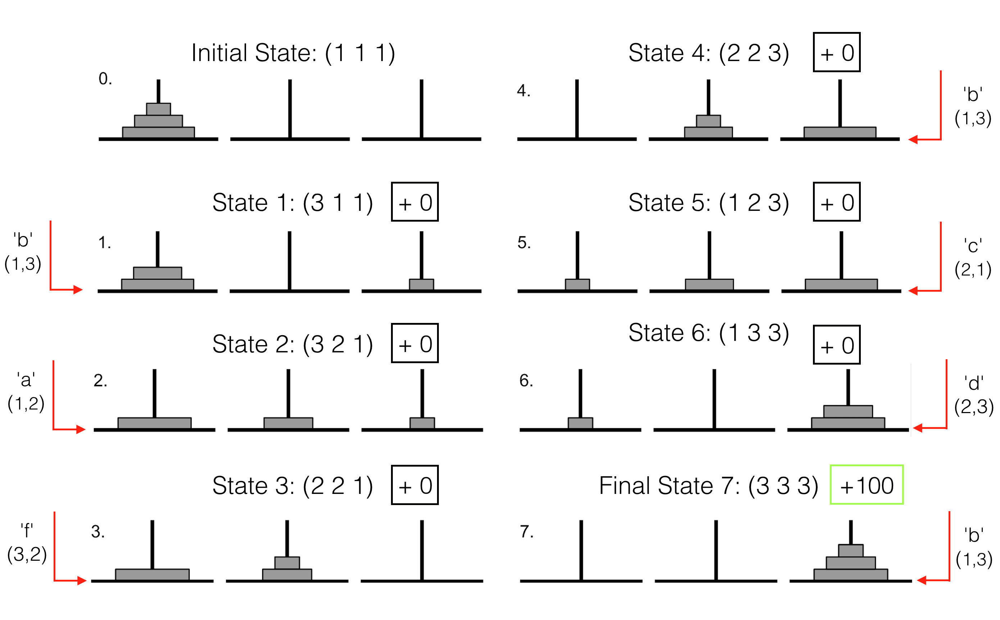

# gym-hanoi
## A Towers of Hanoi environment in OpenAI Gym Style
## Author: Robert Tjarko Lage
## Date: 09/2018

This repository extends the OpenAI gym with the classical Towers of Hanoi environment.

* Game Description: Environment consists of three pegs and a number of disks (N) of different sizes which can slide onto the pegs. The puzzle starts with all disks stacked on the first peg in ascending order, with the largest at the bottom and the smallest on top. The objective of the game is to move all the disks to the third peg. The only legal moves are those which take the top-most disk from one peg to another, with the restriction that a disk may never be placed upon a smaller disk.

* States: Tuple of len N (number of discs) - elements: pole indices in $[0,1,2]$.

* Actions: Integer between 0 and 5 (see descriptions below).

* Episode terminates (successfully) if $s_{t+1} = (2)_{i=1}^N$.

* Below you can find the optimal policy for N=3 (and states indexed from 1 to 3):




# Action Space
* $(0,1)$ - top disk of pole 0 to top of pole 1 - "a".
* $(0,2)$ - top disk of pole 0 to top of pole 2 - "b".
* $(1,0)$ - top disk of pole 1 to top of pole 0 - "c".
* $(1,2)$ - top disk of pole 1 to top of pole 2 - "d".
* $(2,0)$ - top disk of pole 2 to top of pole 0 - "e".
* $(2,1)$ - top disk of pole 2 to top of pole 1 - "f".

# State Space

Definition of states (e.g. $N=3$):
* $(0,0,0)$ - Initial state where all 3 three disks are stacked on pole 0.
* $(2,2,2)$ - Final state where all 3 three disks are stacked on pole 2.
* $(0,1,2)$ - Smallest disk on pole 0, middle disk on pole 1, largest on pole 2.

# Installation

* Clone the repository and install the package.
```
git clone https://github.com/RobertTLange/gym-hanoi
cd gym_hanoi
pip install -e .
```

* Import the package and create an environment (default number of disks is 4 and transitions are deterministic).
* **reset** - Episode starts in N-dimensional tuple of zeros (starting position with all disks on first pole)
* **step** - Returns new state, transition reward, episode status and information about transition (Did environmental noise currupt transition?, Was the action valid?)


* You can set the number of desired disks and the transition failure rate in the following way:


# Notes
* Environment is especially suited for prototyping solutions to long-term credit assignment problems, sparse rewards and curriculum learning.
* Following format guide in https://github.com/openai/gym/tree/master/gym/envs#how-to-create-new-environments-for-gym.
